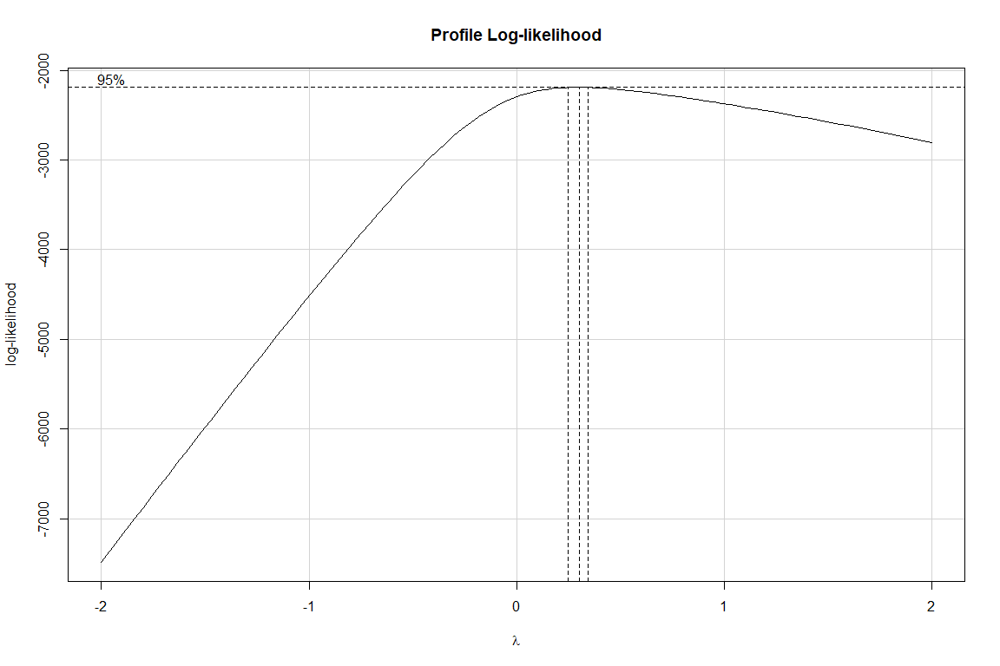
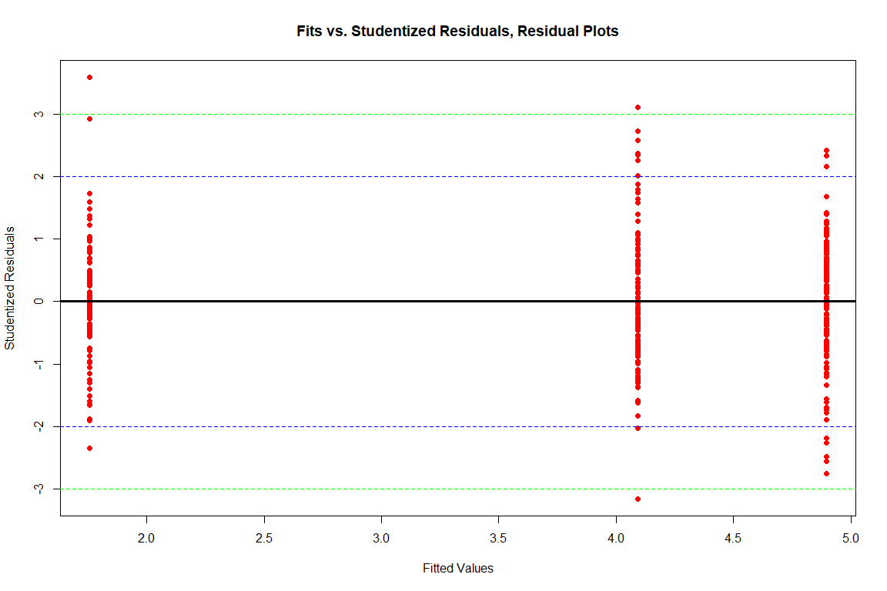
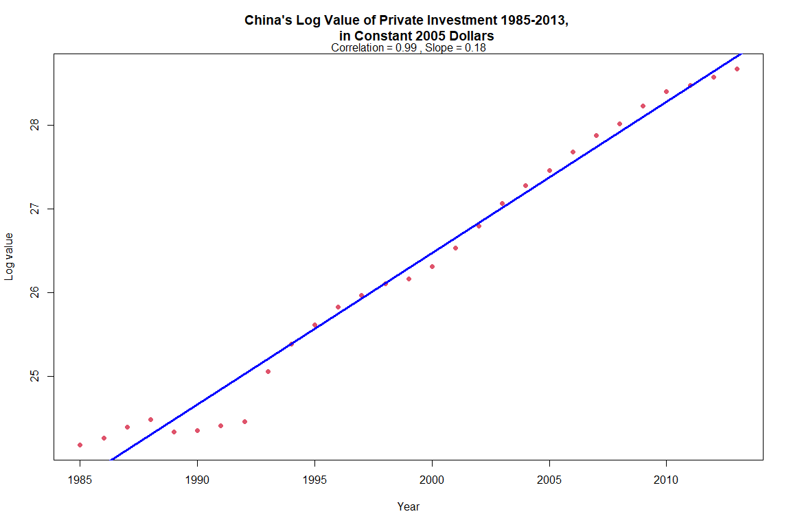
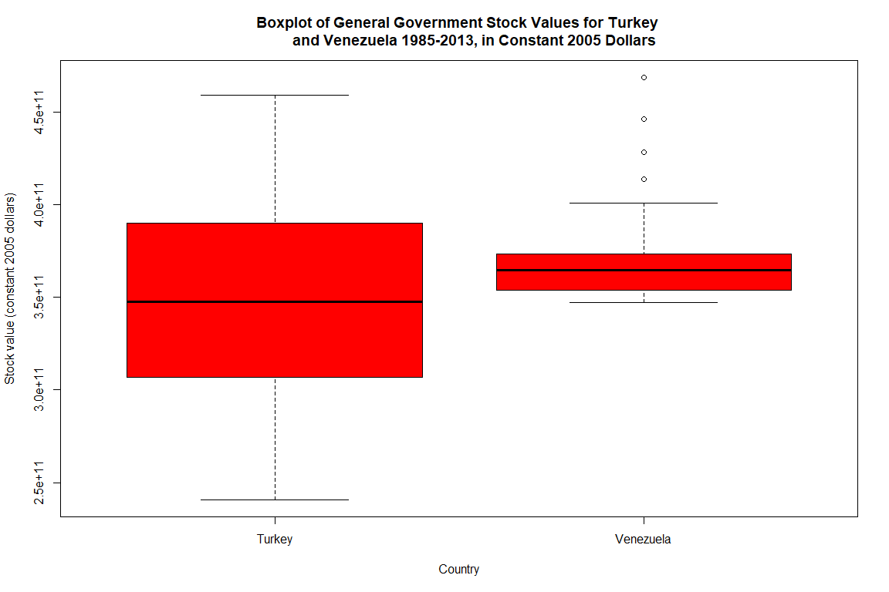
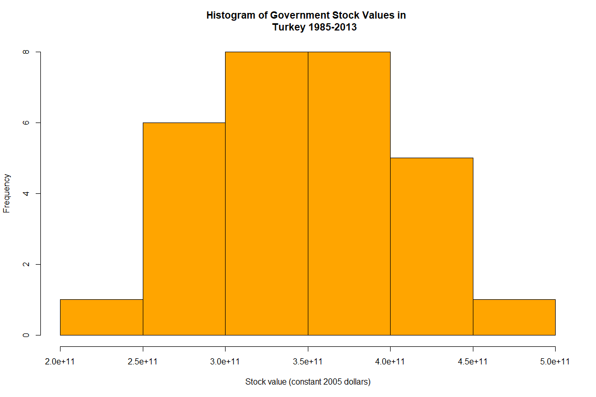
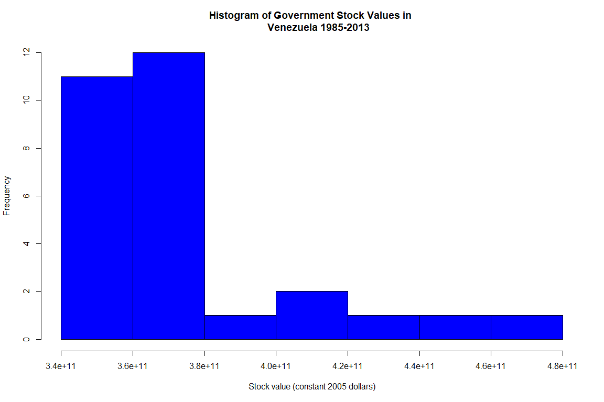

S&DS 230 Final Project
================
5/6/2022

-   [Introduction](#introduction)
-   [Data](#data)
-   [Data Cleaning](#data-cleaning)
-   [Capital Stocks](#capital-stocks)
-   [Private Investments - United States and
    China](#private-investments---united-states-and-china)
-   [General Government Capital Stocks - Turkey and
    Venezuela](#general-government-capital-stocks---turkey-and-venezuela)
-   [Capital Stocks - Multiple
    Regression](#capital-stocks---multiple-regression)
-   [Conclusions and Summary](#conclusions-and-summary)

## Introduction

For our project, we have decided to use the Investment and Capital Stock
(ICSD) data set from the International Monetary Fund. It contains data
on investment and capital stock for government, private sector, and
public-private partnerships across various countries between the years
1960 and 2013. We chose this data set because we have a shared interest
in the financial services industry, and analysis in this dataset can
prove to be useful for economists, investors, policy makers, and
government officials.

## Data

``` r
# Necessary libraries
library("car")
```

    ## Warning: package 'car' was built under R version 4.1.2

    ## Loading required package: carData

    ## Warning: package 'carData' was built under R version 4.1.2

``` r
source("http://www.reuningscherer.net/s&ds230/Rfuncs/regJDRS.txt")
```

    ## Warning: package 'olsrr' was built under R version 4.1.2

    ## 
    ## Attaching package: 'olsrr'

    ## The following object is masked from 'package:datasets':
    ## 
    ##     rivers

``` r
# Load data
data <- read.csv("Investment and Capital Stock (ICSD)_ICSD_05-08-2016 17-46-32-23_timeSeries.csv")
data <- data[, c(1, 3, 5, 33:61)]

#Commented out below lines to reduce report length
# head(data)
# dim(data)
# names(data)
```

### Categorical Variables:

Country Name: The name of the county. Cleaned up the name of the first
column of country names to nicely format into “Country.Name”

Indicator Name: Indicators come in categories which interpret financial
data for each country, yielding quantitative measurements. Throughout
the project we grouped these indicators into stocks and investments.
Stocks: (Private capital stock, Public-private partnership capital
stock, and General government capital stock) and Investments: (General
government investment, Private investment, and Public-private
partnership investment).

Year (1985 to 2013): Although the years start from 1960 and end in 2013,
we will focus on the years from 1985 to 2013 because for Public-private
partnerships there is no data for any country until 1985. If we were to
omit this data, then all data for Public-private partnerships for all
countries would be omitted. Cleaned by starting years from 1985, and by
getting rid of the X in XYear (ex. to make X2001 into 2001).

### Continuous Variables:

These continuous variables do not appear as part of the variable names
of the data set, but rather appear as individual data within Indicator
Name.

Capital Stock (Private, Public-private partnership, and General
government): The amount of common and preferred shares of a company. In
other words, the ownership a company has.

Investment (General government, Private, Public-private partnership):
Acquiring an asset in order to generate income.

Note: Both Capital Stock and Investment TOGETHER do belong in Indicator
Name as categories, but INDIVIDUALLY there are both separate groups of
continuous variables as they both have quantitative values and can take
on unlimited measurements in between highest and lowest points of
measurements.

We ran into the issue of having two different units, used inconsistently
with capital stocks and investments, so when analyzing data we want the
units to be consistent. In future R chunks, we made sure to isolate the
continuous variable AND the unit to ensure consistency in our analysis.

The two different units are: 1) Percent of GDP: GDP stands for Gross
domestic product, which measures the market value of goods and services
produced. 2) PPP, Constant 2005 Dollars: (PPP) stands for purchasing
power parity, which essentially compares different the currencies of
different countries by looking at the ratios of different price of goods
in each country, and we are comparing this to 2005 for consistency. This
number essentially gives a universal currency value.

To finish off our cleaning, we removed rows with missing entries. Some
of the aforementioned cleaning code is appears in more relevant, future
R chunks, such as in the (Private Investments) section. We transposed
and resetting indices, because of the horizontal formatting of the
years. After speaking with JDRS, We also decided to take a look at only
certain years, such as 2013 for stock values, and years that are spaced
apart to ensure independence in our time series nature of the data.  
Important ratio in our analysis: Stock Value as Percent of GDP: The
stock market capitalization (stock value)-to-GDP ratio helps determine
if an overall market is undervalued or overvalued compared to it’s
historical average. This data table below explains how to evaluate these
ratios.

``` r
valueGDP <- data.frame(
  Valuation_For_Market = c("Undervalued", "Fair Valued", "Overvalued"),
  StockValueAsPercentofGDP = c("Below 75%", "75% to 90%", "Above 90%")
)
valueGDP
```

    ##   Valuation_For_Market StockValueAsPercentofGDP
    ## 1          Undervalued                Below 75%
    ## 2          Fair Valued               75% to 90%
    ## 3           Overvalued                Above 90%

## Data Cleaning

``` r
# Rename name column
colnames(data)[1] <- "Country.Name"

#Get rid of the X in XYear
for (i in 1985:2013) {
  colnames(data)[which(names(data) == paste0("X", i))] <- as.character(i)
}

# Remove rows with missing entries
data <- na.omit(data)

#Commented out below line to reduce report length
head(data)
```

    ##   Country.Name                   Indicator.Name                  Unit.Name
    ## 1      Iceland            Private capital stock             Percent of GDP
    ## 2        India    General government investment PPP, Constant 2005 Dollars
    ## 4       Sweden    General government investment             Percent of GDP
    ## 5       Sweden General government capital stock             Percent of GDP
    ## 6       Sweden               Private investment             Percent of GDP
    ## 7       Sweden            Private capital stock             Percent of GDP
    ##           1985         1986         1987         1988         1989         1990
    ## 1 2.239532e+02 2.142464e+02 1.999831e+02 2.055065e+02 2.089071e+02 2.081951e+02
    ## 2 8.166883e+10 9.567942e+10 8.336751e+10 8.834972e+10 8.591322e+10 8.357326e+10
    ## 4 2.489846e+00 2.367213e+00 2.311845e+00 2.393032e+00 2.575494e+00 2.504677e+00
    ## 5 5.772387e+01 5.672356e+01 5.528625e+01 5.428614e+01 5.335073e+01 5.361681e+01
    ## 6 1.372639e+01 1.363865e+01 1.413425e+01 1.454616e+01 1.581473e+01 1.579085e+01
    ## 7 1.530069e+02 1.522668e+02 1.503690e+02 1.501008e+02 1.499291e+02 1.536313e+02
    ##           1991         1992         1993         1994         1995         1996
    ## 1 2.106379e+02 2.198653e+02 2.163490e+02 2.054707e+02 2.020556e+02 1.900359e+02
    ## 2 9.335194e+10 8.788319e+10 8.749364e+10 1.032305e+11 1.084347e+11 9.202766e+10
    ## 4 2.745068e+00 2.795023e+00 3.048633e+00 3.440139e+00 3.305938e+00 2.991347e+00
    ## 5 5.481489e+01 5.620729e+01 5.812455e+01 5.679168e+01 5.575797e+01 5.600597e+01
    ## 6 1.407816e+01 1.238958e+01 9.748518e+00 9.781026e+00 1.061055e+01 1.130463e+01
    ## 7 1.598542e+02 1.638518e+02 1.672827e+02 1.581112e+02 1.493844e+02 1.457358e+02
    ##           1997         1998         1999         2000         2001         2002
    ## 1 1.823193e+02 1.736855e+02 1.738626e+02 1.714249e+02 1.709543e+02 1.746919e+02
    ## 2 8.839903e+10 9.679959e+10 1.042166e+11 1.056952e+11 1.106845e+11 1.160904e+11
    ## 4 2.585725e+00 2.623500e+00 2.639088e+00 2.320427e+00 2.373382e+00 2.533743e+00
    ## 5 5.522157e+01 5.344924e+01 5.167909e+01 4.995072e+01 4.955572e+01 4.868315e+01
    ## 6 1.135427e+01 1.193777e+01 1.251762e+01 1.297171e+01 1.278226e+01 1.207366e+01
    ## 7 1.411170e+02 1.352460e+02 1.300436e+02 1.255891e+02 1.257607e+02 1.242070e+02
    ##           2003         2004         2005         2006         2007         2008
    ## 1 1.715906e+02 1.619966e+02 1.577612e+02 1.649599e+02 1.741346e+02 1.832661e+02
    ## 2 1.257188e+11 1.349622e+11 1.568524e+11 1.895190e+11 2.103863e+11 2.461145e+11
    ## 4 2.403143e+00 2.363034e+00 2.352889e+00 2.386860e+00 2.396053e+00 2.518162e+00
    ## 5 4.800863e+01 4.665492e+01 4.559860e+01 4.399185e+01 4.299091e+01 4.382897e+01
    ## 6 1.207818e+01 1.239002e+01 1.310589e+01 1.376079e+01 1.460570e+01 1.485030e+01
    ## 7 1.220040e+02 1.184014e+02 1.159895e+02 1.128193e+02 1.116796e+02 1.159797e+02
    ##           2009         2010         2011         2012         2013
    ## 1 1.999633e+02 1.988050e+02 1.843257e+02 1.752527e+02 1.647413e+02
    ## 2 2.572871e+11 2.696542e+11 2.578957e+11 2.880002e+11 2.826391e+11
    ## 4 2.687351e+00 2.664700e+00 2.569208e+00 2.638455e+00 2.514514e+00
    ## 5 4.671789e+01 4.450250e+01 4.381941e+01 4.381443e+01 4.370204e+01
    ## 6 1.274272e+01 1.289321e+01 1.378593e+01 1.404745e+01 1.372467e+01
    ## 7 1.252563e+02 1.177908e+02 1.149388e+02 1.150154e+02 1.147243e+02

## Capital Stocks

``` r
capital_stocks <- data[data$Indicator.Name %in% c("General government capital stock", "Private capital stock", "Public-private partnership capital stock") & data$Unit.Name == "Percent of GDP", ]

boxplot(capital_stocks$`2013` ~ capital_stocks$Indicator.Name,
        main = "International Capital Stock Values as 
        Percent of GDP in 2013, by Stock Type", 
        xlab = "Stock type", 
        ylab = "Stock value (percent of GDP)",
        col = "yellow", cex.axis = 0.85)
```

<!-- -->

*Both the Public-private partnership capital stock and the Private
capital stock boxplots in general do not overlap, therefore this
suggests a difference between both of these groups. All 3 boxplot
medians are different, and the spread of the Public-private partnership
capital stock is much smaller than the spread of General government
capital stock and Private capital stock. With the exception of outliers,
all 3 box plots seem to be symmetric. All 3 boxplots have outliers which
may skew the results towards a higher Stock value (in percent of GDP).
Countries such as Lebanon skew these results (Stock value is 278% of GDP
in 2013 for private capital stock). This percentage is far above 90%,
therefore in 2013 Lebanon’s overall market is far overvalued compared to
it’s historical average regarding all private capital stock.*

*We would like to examine if there are differences in the mean percent
of GDP between stock types for all international capital stocks in 2013.
To do this, we perform an ANOVA test.*

### ANOVA

``` r
sds <- tapply(capital_stocks$`2013`, capital_stocks$Indicator.Name, sd)
round(max(sds) / min(sds), 1)
```

    ## [1] 5.1

*We see that the assumption of equal variances of ANOVA is violated,
since the ratio between highest sd and lowest sd is 5.1 &gt; 2.
Therefore, a transformation should be applied. The transformation
necessary to be applied can be determined using a Box Cox
transformation.*

``` r
aov1 <- aov(capital_stocks$`2013` ~ capital_stocks$Indicator.Name)
trans1 <- boxCox(aov1)
```

<!-- -->

``` r
trans1$x[which.max(trans1$y)]
```

    ## [1] 0.3030303

*The value of lambda suggests that a cube root transformation should be
used (it is suggested that we transform by Y^0.3030303, which is
approximately a cube root transformation. Thus, we raise the capital
stocks from 2013 to the 1/3 power). Refitting the model with this
transformation yields the following:*

``` r
aov2 <- aov((capital_stocks$`2013`)^(1/3) ~ capital_stocks$Indicator.Name -1)
summary(aov2)
```

    ##                                Df Sum Sq Mean Sq F value Pr(>F)    
    ## capital_stocks$Indicator.Name   3   5635  1878.4    4025 <2e-16 ***
    ## Residuals                     357    167     0.5                   
    ## ---
    ## Signif. codes:  0 '***' 0.001 '**' 0.01 '*' 0.05 '.' 0.1 ' ' 1

*The summary information of our ANOVA model reveals that there is a
significant difference between at least two of the capital stock type
groups. The p-value for 2013 capital stocks after transformation is 2 x
10^-16, which is far less than 0.05. In order to determine which groups
are different, multiple comparison tests need to be used.*

### Tukey test

``` r
TukeyHSD(aov2)
```

    ##   Tukey multiple comparisons of means
    ##     95% family-wise confidence level
    ## 
    ## Fit: aov(formula = (capital_stocks$`2013`)^(1/3) ~ capital_stocks$Indicator.Name - 1)
    ## 
    ## $`capital_stocks$Indicator.Name`
    ##                                                                                 diff
    ## Private capital stock-General government capital stock                     0.8052861
    ## Public-private partnership capital stock-General government capital stock -2.3332121
    ## Public-private partnership capital stock-Private capital stock            -3.1384982
    ##                                                                                  lwr
    ## Private capital stock-General government capital stock                     0.6066355
    ## Public-private partnership capital stock-General government capital stock -2.5479356
    ## Public-private partnership capital stock-Private capital stock            -3.3532218
    ##                                                                                 upr
    ## Private capital stock-General government capital stock                     1.003937
    ## Public-private partnership capital stock-General government capital stock -2.118488
    ## Public-private partnership capital stock-Private capital stock            -2.923775
    ##                                                                           p adj
    ## Private capital stock-General government capital stock                        0
    ## Public-private partnership capital stock-General government capital stock     0
    ## Public-private partnership capital stock-Private capital stock                0

``` r
par(mar = c(5, 11, 4, 1))
```

``` r
plot(TukeyHSD(aov2), las = 1)
```

<!-- -->

*Performing a Tukey test results in the conclusion that each 2013 stock
type is significantly different in the transformed percents of GDP. All
of the 95% confidence intervals (check R Markdown for figure) comparing
all pairs of means across Private, Public-private partnership, and
General government capital stocks don’t include zero. Using alpha =
0.05, and 95% confidence interval, we can reject the null hypothesis
that there isn’t a difference between 2013 stock types.*

### Residual Plots

*To check if the ANOVA model assumptions have been met, the residual
plots must be checked.*

``` r
myResPlots2(aov2)
```

<!-- --><!-- -->

*The normal quantile plot suggests that the errors are approximately
normally distributed, as indicated by the linear trend. The residual
plot does not display any signs of heteroskedasticity, though there do
appear to be three cases in which the errors exceed +/-3 standard
deviations. However, there are no glaringly large errors. The vertical
spread appears to be roughly the same. Thus, there is no evidence of
lack of fit, and not much evidence for non linear trend.*

``` r
sds <- tapply((capital_stocks$`2013`)^(1/3), capital_stocks$Indicator.Name, sd)
round(max(sds) / min(sds), 1)
```

    ## [1] 1.1

*We can see that the transformation drastically improved the ratio of
standard deviations, as it is now much lower than 2.*

## Private Investments - United States and China

Next, we decided to examine the monetary value of private investments
over time between the United States and China. We extracted a subset of
data and did some additional cleaning, including transposition and
resetting indices, because of the horizontal formatting of the years,
which is not ideal for time series data.

``` r
investments <- data[data$Country.Name %in% c("China", "United States") & data$Indicator.Name == "Private investment" & data$Unit.Name == "PPP, Constant 2005 Dollars", ]
investments <- t(investments)
investments <- investments[4:32, ]
investments <- cbind(year = rownames(investments), investments)
investments <- as.data.frame(investments)
rownames(investments) <- NULL
colnames(investments) <- c("year", "United States", "China")
investments$year <- as.numeric(investments$year)
investments$`United States` <- as.numeric(investments$`United States`)
investments$China <- as.numeric(investments$China)
```

``` r
plot(investments$year, investments$`United States`, pch = 16,
     col = 1, ylim = c(0, 3000000000000),
     main = "Value of Private Investments for the United States vs. 
     China 1985-2013, in Constant 2005 Dollars", xlab = "Year", ylab = "Value of investments (constant 2005 dollars)")
points(investments$year, investments$China, pch = 16, col = 2)
legend("topleft", c("United States", "China"), pch = 16, 
       col = c(1, 2))
```

<!-- -->

*Overall, for both U.S and China individually, as the year increases,
there is an increase in the value of investments (measured in constant
2005 dollars). This makes sense, as the U.S. and China are both highly
developed countries and improve technologically throughout the years. It
is important to note that at around 2008 and 2009, the Value of
investments in China surpasses the value of investments in the United
States. This is due to numerous reasons, but some prominent reasons
include the fact that the US went through the 2008 Financial Crisis (due
primarily to deregulation in the financial industry) and the increased
US dependence on supplies and credit from China.*

### Correlation and Regression

*We would like to model China’s private investments in 2005 dollars as a
function of time, specifically with the value of the investments on the
log scale due to the exponential-like growth. To do this, we calculate
the correlation and fit a regression line.*

``` r
cor1 <- cor(investments$year, log(investments$China))
cor.test(investments$year, log(investments$China))
```

    ## 
    ##  Pearson's product-moment correlation
    ## 
    ## data:  investments$year and log(investments$China)
    ## t = 38.186, df = 27, p-value < 2.2e-16
    ## alternative hypothesis: true correlation is not equal to 0
    ## 95 percent confidence interval:
    ##  0.9804059 0.9957563
    ## sample estimates:
    ##       cor 
    ## 0.9908684

``` r
lm1 <- lm(log(investments$China) ~ investments$year)
summary(lm1)
```

    ## 
    ## Call:
    ## lm(formula = log(investments$China) ~ investments$year)
    ## 
    ## Residuals:
    ##      Min       1Q   Median       3Q      Max 
    ## -0.56348 -0.12844  0.04298  0.12326  0.42606 
    ## 
    ## Coefficients:
    ##                    Estimate Std. Error t value Pr(>|t|)    
    ## (Intercept)      -3.355e+02  9.473e+00  -35.41   <2e-16 ***
    ## investments$year  1.810e-01  4.739e-03   38.19   <2e-16 ***
    ## ---
    ## Signif. codes:  0 '***' 0.001 '**' 0.01 '*' 0.05 '.' 0.1 ' ' 1
    ## 
    ## Residual standard error: 0.2135 on 27 degrees of freedom
    ## Multiple R-squared:  0.9818, Adjusted R-squared:  0.9811 
    ## F-statistic:  1458 on 1 and 27 DF,  p-value: < 2.2e-16

``` r
plot(investments$year, log(investments$China), 
     main = "China's Log Value of Private Investment 1985-2013, 
     in Constant 2005 Dollars", xlab = "Year",
     ylab = "Log value", pch = 16, col = 2)
mtext(paste0("Correlation = ", round(cor1, 2), " , Slope = ", round(lm1$coef[2], 2)))
abline(lm1$coef, col = "blue", lwd = 3)
```

<!-- -->
*According to our Pearson’s product-moment correlation, There is a very
strong positive correlation between China’s private investments in 2005
dollars (log scale) as a function of time: 0.9908684. The p-value &lt;
2.2e-16, which is far less than alpha = 0.05. Thus it is unlikely that
our results happened by chance. This makes sense due to China’s
increasing global investments and growing economy and China’s open door
economic policy. This is reflected in the graph: as the years increase,
China’s log value in of private investment increases as well. Our slope
coefficient is 0.18 and the p-value is &lt;2e-16, far less than 0.05. In
other words, the log value of China’s private investment increases by
0.18 every single year on average from 1985 to 2013.*

### Bootstrap

*We will now bootstrap this data to get a bootstrapped confidence
interval for the correlation.*

``` r
set.seed(240)

temp <- investments["year"]
temp$logChina <- log(investments$China)

N <- nrow(temp)

n_samp <- 5000

corResults <- rep(NA, n_samp)

for(i in 1:n_samp){
  s <- sample(1:N, N , replace = T)
  fakeData <-  temp[s, ]

  corResults[i] <- cor(fakeData[, 1], fakeData[, 2])
}

ci_r <- quantile(corResults, c(.025, .975))

hist(corResults, col = "blue", main = "Bootstrapped Correlations", xlab = "Sample Correlation", breaks = 50)

abline(v = ci_r, lwd = 3, col = "red")
abline(v = cor.test(temp$year, temp$logChina)$conf.int, lwd = 3, col = "green", lty = 2)
legend("topleft", c("Theoretical CI","Boot CI"), lwd = 3, col = c("green","red"), lty = c(2, 1))
```

<!-- -->

*It appears that the bootstrapped confidence interval gives us a
narrower range than the theoretical confidence interval, and the upper
bound of the bootstrapped interval is slightly higher than the upper
bound of the theoretical confidence interval. From both theoretical and
bootstrapped 95% confidence intervals, our correlation values are above
0.98, thus with 95% confidence we can conclude that there is a strong
positive correlation value between China’s private investments in 2005
dollars (log scale) and time.*

## General Government Capital Stocks - Turkey and Venezuela

*We will next compare the mean values of general government capital
stock in constant 2005 dollars between Turkey and Venezuela.*

``` r
govstocks <- data[data$Country.Name %in% c("Turkey", "Venezuela") & data$Indicator.Name == "General government capital stock" & data$Unit.Name == "PPP, Constant 2005 Dollars", ]

temp_turkey <- as.data.frame(t(govstocks[govstocks$Country.Name == "Turkey", 4:32]))
temp_turkey$Country.Name <- rep("Turkey", nrow(temp_turkey))
colnames(temp_turkey)[1] <- "Value"

temp_venezuela <- as.data.frame(t(govstocks[govstocks$Country.Name == "Venezuela", 4:32]))
temp_venezuela$Country.Name <- rep("Venezuela", nrow(temp_venezuela))
colnames(temp_venezuela)[1] <- "Value"

govstocks <- rbind(temp_turkey, temp_venezuela)

boxplot(govstocks$Value ~ govstocks$Country.Name,
        main = "Boxplot of General Government Stock Values for Turkey 
        and Venezuela 1985-2013, in Constant 2005 Dollars", 
        xlab = "Country", 
        ylab = "Stock value (constant 2005 dollars)", 
        col = "red")
```

<!-- -->

*The box plot for Turkey’s general government capital stock value has a
larger spread than Venezuela’s general government capital stock value,
but both countries’ median stock value are roughly similar (around 3.6 x
10^ 11). Venezuela’s government stock value has some high stock value
outliers and a possible right skew (towards higher stock value).*

``` r
hist(govstocks$Value[govstocks$Country.Name == "Turkey"], col = "orange", main = "Histogram of Government Stock Values in 
     Turkey 1985-2013", xlab = "Stock value (constant 2005 dollars)")
```

<!-- -->

``` r
hist(govstocks$Value[govstocks$Country.Name == "Venezuela"], col = "blue", main = "Histogram of Government Stock Values in 
     Venezuela 1985-2013", xlab = "Stock value (constant 2005 dollars)")
```

<!-- -->

*The histogram for government stock values in Turkey from 1985-2013
appears to be symmetric. We can confirm Venezuela’s government stock
value (in constant 2005 dollars) right skew from 1985-2013 with this
histogram. This could be explained by the fact due to increased
inflation in the Venezuelan Bolivar and/or political crisis and
misrepresentation of stocks around 2010, which could be producing these
outlying stock values, which PPP (see definition in variables) may fail
to account for due to lack of regulation in price of goods.*

### T-test

``` r
t.test(govstocks$Value ~ govstocks$Country.Name)
```

    ## 
    ##  Welch Two Sample t-test
    ## 
    ## data:  govstocks$Value by govstocks$Country.Name
    ## t = -1.9468, df = 41.892, p-value = 0.05829
    ## alternative hypothesis: true difference in means between group Turkey and group Venezuela is not equal to 0
    ## 95 percent confidence interval:
    ##  -48817478905    879685802
    ## sample estimates:
    ##    mean in group Turkey mean in group Venezuela 
    ##            349331410345            373300306897

*The p-value = 0.05829, is greater than alpha = 0.05. Therefore, we fail
to reject null hypothesis, and thus there is no evidence for true
difference in means between Venezuela’s government stock value and
Turkey’s government stock value from 1985-2013*

### Permutation Test

``` r
actualdiff <- by(govstocks$Value, govstocks$Country.Name, mean)
actualdiff <- actualdiff[1] - actualdiff[2]

N <- 10000
diffvals <- rep(NA, N)
for (i in 1:N) {
  fakename <- sample(govstocks$Country.Name)
  diffvals[i] <- mean(govstocks$Value[fakename == "Turkey"]) - mean(govstocks$Value[fakename == "Venezuela"])
}

hist(diffvals, col = "yellow", main = "Permuted Sample Means Diff in Government Stock Values", xlab = "Constant 2005 Dollars", breaks = 50)
abline(v = actualdiff, col = "blue", lwd = 3)
text(actualdiff - 2000000000, 310, paste("Actual Diff in Means =", round(actualdiff, 2)), srt = 90)
```

<!-- -->

``` r
mean(abs(diffvals) >= abs(actualdiff))
```

    ## [1] 0.0596

*Our p-value for mean differences between Venezuela’s government stock
value and Turkey’s government stock value from 1985-2013 is 0.0596. This
is greater than alpha = 0.05, thus at the 95% confidence level, we fail
to reject the null hypothesis (that there is no difference in mean
between Venezuela’s government stock value and Turkey’s government stock
value). The actual diff in means is about -23,968,896,551, and the
permuted histogram appears to be symmetric, centered at around 0
Constant 2005 dollars.*

## Capital Stocks - Multiple Regression

Our plan for multiple regression is to develop the best model for 2013
capital stocks (General government capital stock, Private capital stock,
and Public-private partnership capital stock) to see which variables
(capital stocks from years from 1985 to 2012), are statistically
significant predictors of 2013 capital stocks. We will fit a model then
will perform backwards stepwise regression to eliminate variables that
are not significant at the 5% level from the regression model to
eventually find a simplified model, which can better explain data.

``` r
capital_stocks <- subset(capital_stocks, select = -c(Unit.Name))
glm <- lm(`2013` ~ ., data = capital_stocks)
```

``` r
Anova(glm, type = 3)
```

    ## Anova Table (Type III tests)
    ## 
    ## Response: 2013
    ##                Sum Sq  Df  F value    Pr(>F)    
    ## (Intercept)       6.3   1   0.4819 0.4883894    
    ## Country.Name   4353.1 136   2.4531 5.284e-09 ***
    ## Indicator.Name   44.8   2   1.7167 0.1823984    
    ## `1985`           28.9   1   2.2171 0.1381226    
    ## `1986`           40.9   1   3.1323 0.0783325 .  
    ## `1987`           14.2   1   1.0909 0.2975807    
    ## `1988`            0.6   1   0.0423 0.8372373    
    ## `1989`            2.6   1   0.1969 0.6577175    
    ## `1990`            1.4   1   0.1055 0.7456394    
    ## `1991`            1.1   1   0.0826 0.7741086    
    ## `1992`           19.9   1   1.5229 0.2186819    
    ## `1993`          114.5   1   8.7731 0.0034412 ** 
    ## `1994`           31.4   1   2.4035 0.1227054    
    ## `1995`          160.0   1  12.2653 0.0005733 ***
    ## `1996`          273.2   1  20.9351 8.488e-06 ***
    ## `1997`           24.3   1   1.8653 0.1736090    
    ## `1998`          131.5   1  10.0752 0.0017492 ** 
    ## `1999`          132.5   1  10.1512 0.0016820 ** 
    ## `2000`            0.5   1   0.0382 0.8451799    
    ## `2001`           20.2   1   1.5511 0.2144821    
    ## `2002`          209.3   1  16.0378 8.854e-05 ***
    ## `2003`          458.3   1  35.1217 1.402e-08 ***
    ## `2004`           25.7   1   1.9723 0.1618148    
    ## `2005`           34.4   1   2.6342 0.1062161    
    ## `2006`            3.2   1   0.2457 0.6206685    
    ## `2007`          107.5   1   8.2408 0.0045530 ** 
    ## `2008`           20.3   1   1.5531 0.2141860    
    ## `2009`            0.3   1   0.0258 0.8725349    
    ## `2010`            2.9   1   0.2201 0.6395309    
    ## `2011`          215.6   1  16.5213 6.998e-05 ***
    ## `2012`         3197.9   1 245.0867 < 2.2e-16 ***
    ## Residuals      2518.3 193                       
    ## ---
    ## Signif. codes:  0 '***' 0.001 '**' 0.01 '*' 0.05 '.' 0.1 ' ' 1

We now perform backwards stepwise regression, and let’s keep the
statistically significant predictors (1993, 1998, and 2007 were found to
be insignificant after the first step of removing predictors).

``` r
glm <- lm(`2013` ~ Country.Name + `1995` + `1996` + `1999` + `2002` + `2003` + `2011` + `2012`, data = capital_stocks)

Anova(glm, type = 3)
```

    ## Anova Table (Type III tests)
    ## 
    ## Response: 2013
    ##              Sum Sq  Df  F value    Pr(>F)    
    ## (Intercept)     1.7   1   0.1214   0.72785    
    ## Country.Name 5079.6 136   2.6366 9.048e-11 ***
    ## `1995`        447.3   1  31.5717 5.889e-08 ***
    ## `1996`        500.4   1  35.3205 1.110e-08 ***
    ## `1999`         89.4   1   6.3123   0.01272 *  
    ## `2002`        259.1   1  18.2876 2.852e-05 ***
    ## `2003`        382.2   1  26.9781 4.748e-07 ***
    ## `2011`        963.3   1  67.9976 1.590e-14 ***
    ## `2012`       5424.4   1 382.9103 < 2.2e-16 ***
    ## Residuals    3059.9 216                       
    ## ---
    ## Signif. codes:  0 '***' 0.001 '**' 0.01 '*' 0.05 '.' 0.1 ' ' 1

``` r
summary(glm)
```

    ## 
    ## Call:
    ## lm(formula = `2013` ~ Country.Name + `1995` + `1996` + `1999` + 
    ##     `2002` + `2003` + `2011` + `2012`, data = capital_stocks)
    ## 
    ## Residuals:
    ##     Min      1Q  Median      3Q     Max 
    ## -32.064  -0.867   0.000   0.820  27.259 
    ## 
    ## Coefficients:
    ##                                              Estimate Std. Error t value
    ## (Intercept)                                   0.81758    2.34646   0.348
    ## Country.NameAngola                            4.84668    3.26632   1.484
    ## Country.NameAntigua and Barbuda              -0.80701    4.43502  -0.182
    ## Country.NameArgentina                         0.31994    3.39991   0.094
    ## Country.NameAustralia                        -0.05751    3.53742  -0.016
    ## Country.NameAustria                          -2.99030    3.55023  -0.842
    ## Country.NameBahamas, The                     -0.06030    3.56593  -0.017
    ## Country.NameBahrain                          -0.50340    3.51319  -0.143
    ## Country.NameBangladesh                       -1.07125    3.22445  -0.332
    ## Country.NameBarbados                         -1.06354    3.54053  -0.300
    ## Country.NameBelarus                          -0.58554    4.43829  -0.132
    ## Country.NameBelgium                          -3.61470    3.54907  -1.018
    ## Country.NameBelize                           -0.54587    3.18397  -0.171
    ## Country.NameBenin                            -2.62226    3.17390  -0.826
    ## Country.NameBhutan                           -2.55985    3.23354  -0.792
    ## Country.NameBolivia                          -2.09274    3.23765  -0.646
    ## Country.NameBotswana                         -1.85752    3.25259  -0.571
    ## Country.NameBrazil                           -2.98219    3.22211  -0.926
    ## Country.NameBulgaria                         -2.97827    3.20445  -0.929
    ## Country.NameBurkina Faso                      2.55407    3.16885   0.806
    ## Country.NameBurundi                          -2.59618    3.22725  -0.804
    ## Country.NameCôte d'Ivoire                    0.08545    3.19855   0.027
    ## Country.NameCabo Verde                       -1.67939    3.26521  -0.514
    ## Country.NameCambodia                         -1.24141    3.20836  -0.387
    ## Country.NameCameroon                         -1.13671    3.15058  -0.361
    ## Country.NameCanada                           -2.90925    3.53894  -0.822
    ## Country.NameCentral African Republic         31.72002    3.44028   9.220
    ## Country.NameChad                             -0.12093    3.21285  -0.038
    ## Country.NameChile                             0.73714    3.23303   0.228
    ## Country.NameChina                            -0.89033    3.22144  -0.276
    ## Country.NameColombia                         -0.60810    3.21431  -0.189
    ## Country.NameComoros                          -4.37206    3.20199  -1.365
    ## Country.NameCongo, Republic of               -0.90930    3.20767  -0.283
    ## Country.NameCosta Rica                       -1.01400    3.20545  -0.316
    ## Country.NameDemocratic Republic of the Congo -0.70928    3.23083  -0.220
    ## Country.NameDenmark                          -2.97219    3.55258  -0.837
    ## Country.NameDjibouti                         -3.68054    3.25666  -1.130
    ## Country.NameDominica                         -0.71310    3.20111  -0.223
    ## Country.NameDominican Republic               -2.19405    3.22309  -0.681
    ## Country.NameEcuador                          -0.62096    3.18221  -0.195
    ## Country.NameEgypt                            -1.96042    3.20862  -0.611
    ## Country.NameEl Salvador                      -2.60826    3.22184  -0.810
    ## Country.NameEquatorial Guinea                 2.09254    3.58381   0.584
    ## Country.NameEthiopia                         -0.34703    3.22172  -0.108
    ## Country.NameFiji                             -1.70889    3.18090  -0.537
    ## Country.NameFinland                          -2.56614    3.50140  -0.733
    ## Country.NameFrance                           -3.29314    3.54276  -0.930
    ## Country.NameGabon                            -0.46037    3.20812  -0.143
    ## Country.NameGambia, The                      -1.08486    3.21220  -0.338
    ## Country.NameGermany                          -3.20798    3.55663  -0.902
    ## Country.NameGhana                             1.51967    3.17277   0.479
    ## Country.NameGreece                           -4.86410    3.56426  -1.365
    ## Country.NameGrenada                          -3.07276    3.20809  -0.958
    ## Country.NameGuatemala                        -1.51733    3.19893  -0.474
    ## Country.NameGuinea                            6.83414    3.22134   2.122
    ## Country.NameGuinea-Bissau                     0.51602    3.38130   0.153
    ## Country.NameHonduras                         -0.20829    3.19911  -0.065
    ## Country.NameHong Kong SAR                    -1.18960    3.65945  -0.325
    ## Country.NameIceland                          -3.51245    3.55585  -0.988
    ## Country.NameIndia                            -0.61628    3.20500  -0.192
    ## Country.NameIndonesia                         1.42794    3.27338   0.436
    ## Country.NameIran                             -3.19770    3.20171  -0.999
    ## Country.NameIraq                              0.14284    3.50023   0.041
    ## Country.NameIreland                          -2.36059    3.49338  -0.676
    ## Country.NameIsrael                           -2.07124    3.58386  -0.578
    ## Country.NameItaly                            -3.96627    3.55452  -1.116
    ## Country.NameJamaica                          -1.19185    4.43938  -0.268
    ## Country.NameJapan                            -1.20652    3.59691  -0.335
    ## Country.NameJordan                           -4.22090    3.19910  -1.319
    ## Country.NameKenya                            -1.46293    3.20935  -0.456
    ## Country.NameKorea                            -3.81569    3.63787  -1.049
    ## Country.NameKuwait                            4.20842    3.58372   1.174
    ## Country.NameLao P.D.R.                        0.06077    3.25824   0.019
    ## Country.NameLebanon                          -0.79328    3.22229  -0.246
    ## Country.NameLesotho                          -0.10387    3.24702  -0.032
    ## Country.NameLiberia                          -0.88240    4.44282  -0.199
    ## Country.NameLuxembourg                       -6.53680    3.59444  -1.819
    ## Country.NameMadagascar                        0.22237    3.23805   0.069
    ## Country.NameMalawi                           -5.56391    3.25224  -1.711
    ## Country.NameMalaysia                          2.66634    3.30093   0.808
    ## Country.NameMaldives                         -0.99856    3.25392  -0.307
    ## Country.NameMali                             -2.92920    3.20265  -0.915
    ## Country.NameMauritania                        6.40368    3.16461   2.024
    ## Country.NameMauritius                        -0.57242    3.20195  -0.179
    ## Country.NameMexico                            0.21113    3.19120   0.066
    ## Country.NameMongolia                          0.04028    3.19141   0.013
    ## Country.NameMorocco                           0.50786    3.20619   0.158
    ## Country.NameMozambique                        0.28494    3.15840   0.090
    ## Country.NameNamibia                          -0.68361    3.20386  -0.213
    ## Country.NameNepal                            -0.90809    3.22774  -0.281
    ## Country.NameNetherlands                      -3.30956    3.54866  -0.933
    ## Country.NameNew Zealand                      -0.68518    3.51884  -0.195
    ## Country.NameNiger                             2.13287    3.15223   0.677
    ## Country.NameNigeria                           0.16672    3.10669   0.054
    ## Country.NameNorway                            1.28298    3.51152   0.365
    ## Country.NameOman                             -3.65395    3.59272  -1.017
    ## Country.NamePakistan                         -0.28174    3.19098  -0.088
    ## Country.NamePanama                           -0.09748    3.22408  -0.030
    ## Country.NameParaguay                         -8.15790    3.25838  -2.504
    ## Country.NamePeru                              0.34866    3.20673   0.109
    ## Country.NamePhilippines                      -0.30192    3.21775  -0.094
    ## Country.NamePoland                           -0.78783    3.55852  -0.221
    ## Country.NamePortugal                         -6.76287    3.60365  -1.877
    ## Country.NameQatar                            -5.05334    3.58608  -1.409
    ## Country.NameRomania                          -0.92114    3.18236  -0.289
    ## Country.NameRwanda                            0.06441    3.12930   0.021
    ## Country.NameSão Tomé and Príncipe         -2.23343    3.30227  -0.676
    ## Country.NameSaudi Arabia                      2.28950    3.54646   0.646
    ## Country.NameSenegal                          -1.07753    3.19007  -0.338
    ## Country.NameSierra Leone                     -6.11277    3.51207  -1.741
    ## Country.NameSingapore                        -1.53467    3.71953  -0.413
    ## Country.NameSouth Africa                     -0.19989    3.16003  -0.063
    ## Country.NameSpain                            -3.50388    3.56600  -0.983
    ## Country.NameSri Lanka                        -1.40499    3.19255  -0.440
    ## Country.NameSt. Kitts and Nevis              -7.17588    3.61060  -1.987
    ## Country.NameSt. Lucia                         0.06163    3.22697   0.019
    ## Country.NameSt. Vincent and the Grenadines   -1.77942    3.18947  -0.558
    ## Country.NameSudan                            -0.89295    4.43434  -0.201
    ## Country.NameSuriname                         -0.92695    4.43488  -0.209
    ## Country.NameSwaziland                        -6.05273    3.22586  -1.876
    ## Country.NameSweden                           -2.78470    3.51709  -0.792
    ## Country.NameSwitzerland                      -5.20373    3.56561  -1.459
    ## Country.NameTaiwan Province of China         -2.96142    3.62635  -0.817
    ## Country.NameTanzania                         -1.36490    3.14118  -0.435
    ## Country.NameThailand                          4.72607    3.28769   1.438
    ## Country.NameTogo                              0.84958    3.18962   0.266
    ## Country.NameTrinidad and Tobago               0.04245    3.47573   0.012
    ## Country.NameTunisia                          -0.68129    3.15211  -0.216
    ## Country.NameTurkey                           -1.02544    3.20859  -0.320
    ## Country.NameUganda                           -2.38607    3.20089  -0.745
    ## Country.NameUnited Kingdom                   -2.23874    3.52592  -0.635
    ## Country.NameUnited States                    -1.30094    3.56038  -0.365
    ## Country.NameUruguay                          -0.30014    3.31063  -0.091
    ## Country.NameVenezuela                        -1.45649    3.35120  -0.435
    ## Country.NameVietnam                          -1.74628    3.25100  -0.537
    ## Country.NameZambia                            0.29847    3.17401   0.094
    ## Country.NameZimbabwe                         -0.79022    3.65623  -0.216
    ## `1995`                                       -0.28178    0.05015  -5.619
    ## `1996`                                        0.42318    0.07120   5.943
    ## `1999`                                       -0.11565    0.04603  -2.512
    ## `2002`                                       -0.36970    0.08645  -4.276
    ## `2003`                                        0.38176    0.07350   5.194
    ## `2011`                                       -0.83735    0.10155  -8.246
    ## `2012`                                        1.81176    0.09259  19.568
    ##                                              Pr(>|t|)    
    ## (Intercept)                                    0.7279    
    ## Country.NameAngola                             0.1393    
    ## Country.NameAntigua and Barbuda                0.8558    
    ## Country.NameArgentina                          0.9251    
    ## Country.NameAustralia                          0.9870    
    ## Country.NameAustria                            0.4006    
    ## Country.NameBahamas, The                       0.9865    
    ## Country.NameBahrain                            0.8862    
    ## Country.NameBangladesh                         0.7400    
    ## Country.NameBarbados                           0.7642    
    ## Country.NameBelarus                            0.8952    
    ## Country.NameBelgium                            0.3096    
    ## Country.NameBelize                             0.8640    
    ## Country.NameBenin                              0.4096    
    ## Country.NameBhutan                             0.4294    
    ## Country.NameBolivia                            0.5187    
    ## Country.NameBotswana                           0.5685    
    ## Country.NameBrazil                             0.3557    
    ## Country.NameBulgaria                           0.3537    
    ## Country.NameBurkina Faso                       0.4211    
    ## Country.NameBurundi                            0.4220    
    ## Country.NameCôte d'Ivoire                     0.9787    
    ## Country.NameCabo Verde                         0.6075    
    ## Country.NameCambodia                           0.6992    
    ## Country.NameCameroon                           0.7186    
    ## Country.NameCanada                             0.4119    
    ## Country.NameCentral African Republic          < 2e-16 ***
    ## Country.NameChad                               0.9700    
    ## Country.NameChile                              0.8199    
    ## Country.NameChina                              0.7825    
    ## Country.NameColombia                           0.8501    
    ## Country.NameComoros                            0.1735    
    ## Country.NameCongo, Republic of                 0.7771    
    ## Country.NameCosta Rica                         0.7521    
    ## Country.NameDemocratic Republic of the Congo   0.8264    
    ## Country.NameDenmark                            0.4037    
    ## Country.NameDjibouti                           0.2597    
    ## Country.NameDominica                           0.8239    
    ## Country.NameDominican Republic                 0.4968    
    ## Country.NameEcuador                            0.8455    
    ## Country.NameEgypt                              0.5419    
    ## Country.NameEl Salvador                        0.4191    
    ## Country.NameEquatorial Guinea                  0.5599    
    ## Country.NameEthiopia                           0.9143    
    ## Country.NameFiji                               0.5917    
    ## Country.NameFinland                            0.4644    
    ## Country.NameFrance                             0.3536    
    ## Country.NameGabon                              0.8860    
    ## Country.NameGambia, The                        0.7359    
    ## Country.NameGermany                            0.3681    
    ## Country.NameGhana                              0.6324    
    ## Country.NameGreece                             0.1738    
    ## Country.NameGrenada                            0.3392    
    ## Country.NameGuatemala                          0.6357    
    ## Country.NameGuinea                             0.0350 *  
    ## Country.NameGuinea-Bissau                      0.8788    
    ## Country.NameHonduras                           0.9481    
    ## Country.NameHong Kong SAR                      0.7454    
    ## Country.NameIceland                            0.3244    
    ## Country.NameIndia                              0.8477    
    ## Country.NameIndonesia                          0.6631    
    ## Country.NameIran                               0.3190    
    ## Country.NameIraq                               0.9675    
    ## Country.NameIreland                            0.4999    
    ## Country.NameIsrael                             0.5639    
    ## Country.NameItaly                              0.2657    
    ## Country.NameJamaica                            0.7886    
    ## Country.NameJapan                              0.7376    
    ## Country.NameJordan                             0.1884    
    ## Country.NameKenya                              0.6490    
    ## Country.NameKorea                              0.2954    
    ## Country.NameKuwait                             0.2416    
    ## Country.NameLao P.D.R.                         0.9851    
    ## Country.NameLebanon                            0.8058    
    ## Country.NameLesotho                            0.9745    
    ## Country.NameLiberia                            0.8428    
    ## Country.NameLuxembourg                         0.0704 .  
    ## Country.NameMadagascar                         0.9453    
    ## Country.NameMalawi                             0.0886 .  
    ## Country.NameMalaysia                           0.4201    
    ## Country.NameMaldives                           0.7592    
    ## Country.NameMali                               0.3614    
    ## Country.NameMauritania                         0.0443 *  
    ## Country.NameMauritius                          0.8583    
    ## Country.NameMexico                             0.9473    
    ## Country.NameMongolia                           0.9899    
    ## Country.NameMorocco                            0.8743    
    ## Country.NameMozambique                         0.9282    
    ## Country.NameNamibia                            0.8312    
    ## Country.NameNepal                              0.7787    
    ## Country.NameNetherlands                        0.3521    
    ## Country.NameNew Zealand                        0.8458    
    ## Country.NameNiger                              0.4994    
    ## Country.NameNigeria                            0.9573    
    ## Country.NameNorway                             0.7152    
    ## Country.NameOman                               0.3103    
    ## Country.NamePakistan                           0.9297    
    ## Country.NamePanama                             0.9759    
    ## Country.NameParaguay                           0.0130 *  
    ## Country.NamePeru                               0.9135    
    ## Country.NamePhilippines                        0.9253    
    ## Country.NamePoland                             0.8250    
    ## Country.NamePortugal                           0.0619 .  
    ## Country.NameQatar                              0.1602    
    ## Country.NameRomania                            0.7725    
    ## Country.NameRwanda                             0.9836    
    ## Country.NameSão Tomé and Príncipe           0.4996    
    ## Country.NameSaudi Arabia                       0.5192    
    ## Country.NameSenegal                            0.7359    
    ## Country.NameSierra Leone                       0.0832 .  
    ## Country.NameSingapore                          0.6803    
    ## Country.NameSouth Africa                       0.9496    
    ## Country.NameSpain                              0.3269    
    ## Country.NameSri Lanka                          0.6603    
    ## Country.NameSt. Kitts and Nevis                0.0481 *  
    ## Country.NameSt. Lucia                          0.9848    
    ## Country.NameSt. Vincent and the Grenadines     0.5775    
    ## Country.NameSudan                              0.8406    
    ## Country.NameSuriname                           0.8346    
    ## Country.NameSwaziland                          0.0620 .  
    ## Country.NameSweden                             0.4294    
    ## Country.NameSwitzerland                        0.1459    
    ## Country.NameTaiwan Province of China           0.4150    
    ## Country.NameTanzania                           0.6643    
    ## Country.NameThailand                           0.1520    
    ## Country.NameTogo                               0.7902    
    ## Country.NameTrinidad and Tobago                0.9903    
    ## Country.NameTunisia                            0.8291    
    ## Country.NameTurkey                             0.7496    
    ## Country.NameUganda                             0.4568    
    ## Country.NameUnited Kingdom                     0.5261    
    ## Country.NameUnited States                      0.7152    
    ## Country.NameUruguay                            0.9278    
    ## Country.NameVenezuela                          0.6643    
    ## Country.NameVietnam                            0.5917    
    ## Country.NameZambia                             0.9252    
    ## Country.NameZimbabwe                           0.8291    
    ## `1995`                                       5.89e-08 ***
    ## `1996`                                       1.11e-08 ***
    ## `1999`                                         0.0127 *  
    ## `2002`                                       2.85e-05 ***
    ## `2003`                                       4.75e-07 ***
    ## `2011`                                       1.59e-14 ***
    ## `2012`                                        < 2e-16 ***
    ## ---
    ## Signif. codes:  0 '***' 0.001 '**' 0.01 '*' 0.05 '.' 0.1 ' ' 1
    ## 
    ## Residual standard error: 3.764 on 216 degrees of freedom
    ## Multiple R-squared:  0.9976, Adjusted R-squared:  0.9961 
    ## F-statistic: 636.3 on 143 and 216 DF,  p-value: < 2.2e-16

*(Check R Markdown for the results of the final model when calling
summary(). We decided to not display the summary information, as the
output is about 6 pages in length due to the high number of individual
levels of Country.Name) In addition to the aforementioned years, the
other coefficients that are statistically significant (alpha = 0.05) are
Central African Republic (significant positive coefficient of 31.72002),
Guinea (positive coefficient of 6.83414), Mauritania (positive
coefficient of 6.40368), Paraguay (strong negative coefficient of
-8.15790), St. Kitts and Nevis (negative coefficient of -7.17588). In
other words, being in Central African Republic, Guinea, and Mauritania
increases 2013 capital stock value and being in Paraguay and St. Kitts
and Nevis decreases 2013 capital stock value. The years 1995, 1999,
2002, and 2011 have negative coefficients, while 1996, 2003, and 2012
have positive coefficients. The most significant positive coefficient
for years is 2012 (1.81176). Our final model results appear to be
strong. The Adjusted R-squared is 0.9961, which means that 99.61% of the
variations in our response variables can be explained by the variance in
our indicators. We decided to not transform the country name as it is a
categorical variable. Furthermore, transforming only some of the years
would not make any sense.*

``` r
myResPlots2(glm)
```

<!-- --><!-- -->

*When examining the Normal Quantile plot, without considering extreme
country capital stock values that appear at the tails, our NQ plot of
Studentized residuals does suggest a normal distribution, as our points
mostly fall within the line and are within the blue bands, which is an
assumption of our linear model to be normally distributed. When
considering the extreme values at the tails, this plot does not suggest
a normal distribution as many points do not follow the line. When
looking at the the Fits vs. Studentized Residuals plot, for the most
part, the vertical spread does appear to be roughly even, thus, there is
not much evidence of Heteroscedasticity, nor is there much evidence for
non linear trends. There are, however, a couple of extreme outliers. The
nature of our data is vast as we are considering capital stock values
throughout all countries of the world. Given the major socioeconomic
disparities globally, of course there will be outliers that skew our
data in both higher and lower ends.*

## Conclusions and Summary

*This data was tricky to analyze due to 1) the difficultly in isolating
our continuous variable 2) the time series nature of the data. We
thought of using JDRS’ World Bank Data at first, but we wanted the
chance to apply our course knowledge to something significantly
different than the data sets discussed in class. We also added
additional analysis, such as NQ plot for bootstrapped slopes, and an
extra ratio of standard deviations comparison after our transformation
Y^1/3 to confirm our assumption of equal variances of ANOVA.* *We first
created a box plot of capital stocks in 2013, then conducted an ANOVA
test to test our assumption of equal variances, conducted a Box Cox
transformation that yielded a suggested transformation of Y^1/3,
conducted a Tukey test to determine each 2013 stock type is
significantly different in the transformed percents of GDP, and checked
the residual plots and determined that ANOVA model assumptions have been
met. Next, we decided to examine the monetary value of private
investments over time between the United States and China, so we looked
at the scatter plots to see positive trend for both countries, then
conducted a Pearson’s product-moment correlation to find a very strong
positive correlation between China’s private investments and time, and
bootstrapped correlations and slopes. Afterwards, we compared the mean
values of general government capital stock in between Turkey and
Venezuela using a boxplot and histogram, conducted a t-test and found no
evidence for true difference in means between Venezuela and Turkey
government stock value, and conducted a permutation test which also led
us to fail to reject null hypothesis. Finally, we conducted multiple
regression analysis to develop the best model for 2013 capital stocks
and found significant predictors such as 2012 and the Central African
Republic.*  
*It is clear that the data supports overall macroeconomic trends on
investment and capital stock for government, private sector, and
public-private partnerships across various countries between the years
1985 and 2013. Visualizing the data and breaking down the data helps
yield global trends, such as the the overvaluation in 2013 of Lebanon’s
overall market compared to it’s historical average regarding all private
capital stock, or the 2008 US Financial crisis. Lebanon’s overvaluation
can be potentially explained by the fact that in 2013, stabilization in
inflation led to overvaluation in exchange rates. (Source: Yale School
of Management
<https://som.yale.edu/blog/part-ii-of-crisis-in-lebanon-buildup-of-interrelated-challenges>)
Our data also aligns with China’s open economic policy, and possible
inflation of the Venezuelan Bolivar. Knowing about market valuation,
inflation, and economic policies can help economists, investors, policy
makers, and government officials. Essentially, conducting this final
project helps quantitatively ground macroeconomic trends across the
World.*
